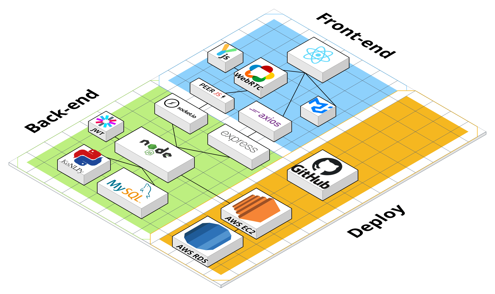
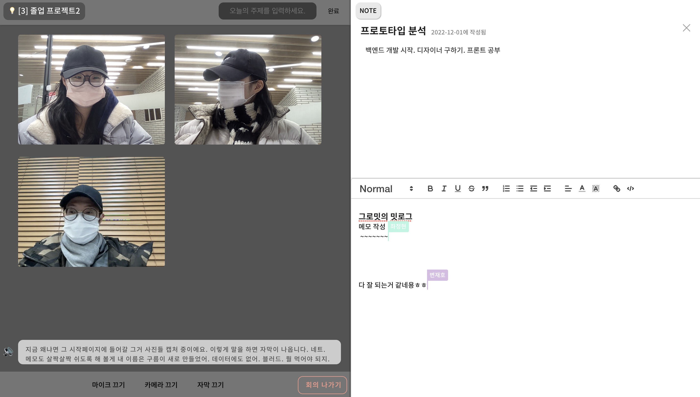
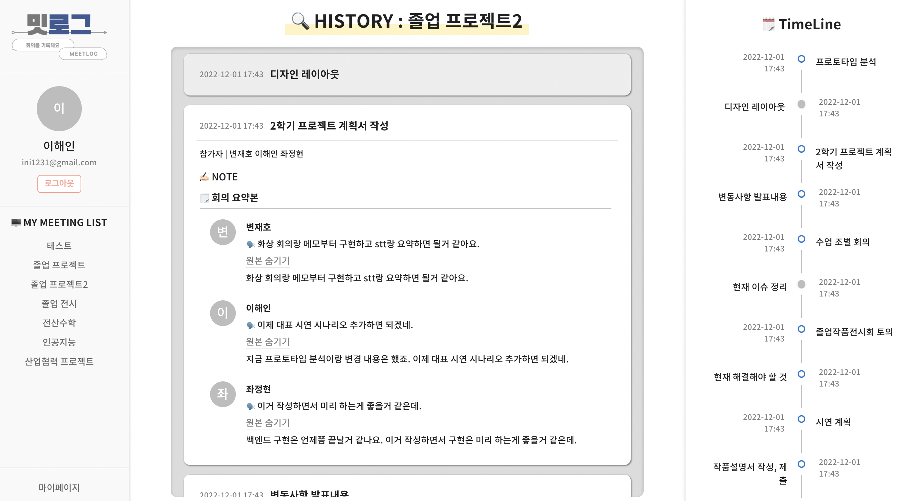
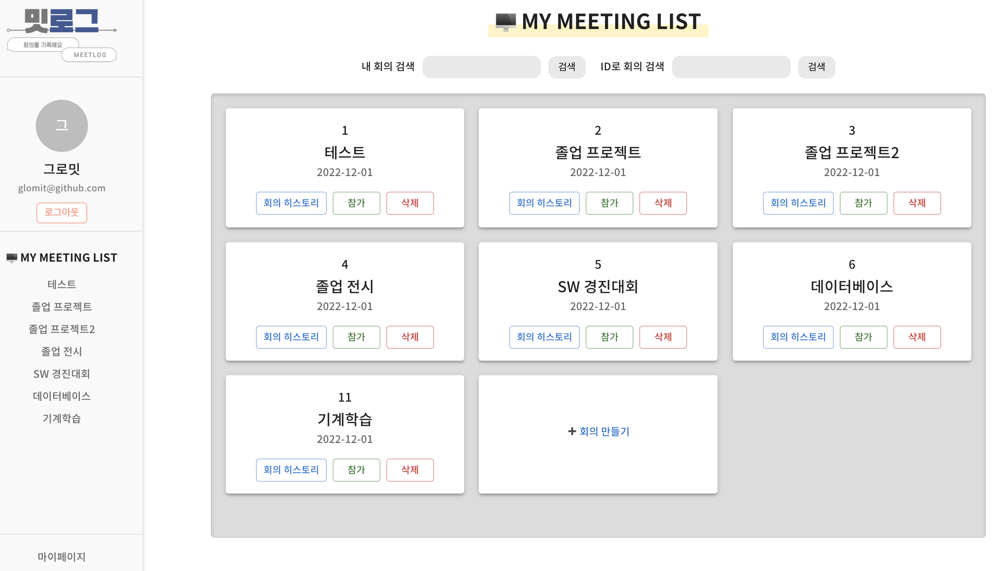
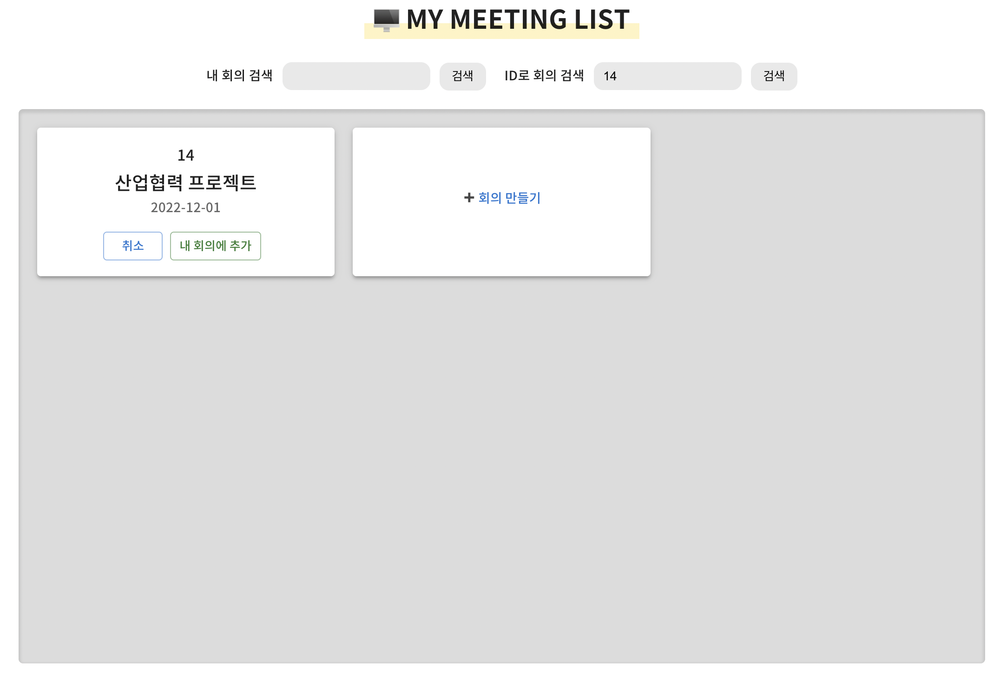
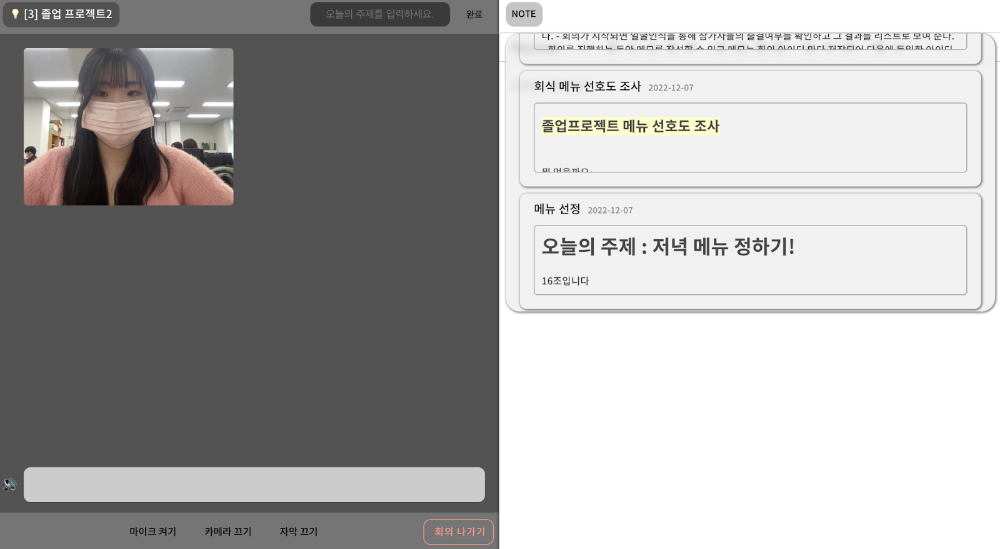
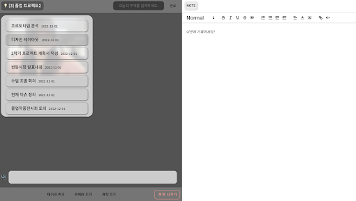
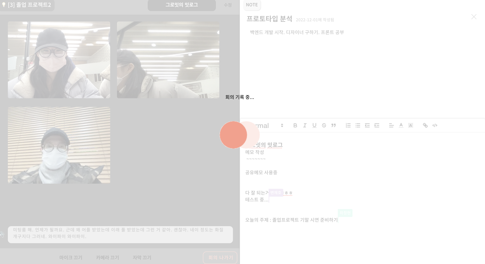
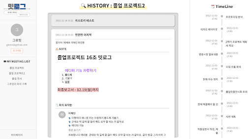

# 2022 건국대 졸업 프로젝트 16팀 졸업작품
## 회의 트래킹 서비스

#### 각 branch 에서 기능을 확인해 볼 수 있습니다.
- prototype 브랜치 : 화상회의 기능
- prototype_stt_summarization 브랜치 : stt, 문서 요약 기능

시스템 구조

# 밋로그:MEETLOG란?

회사 업무회의, 프로젝트 회의, 과제등등 이제는 수업 마저 화상회의로 진행하는 시대!

중요한 내용이 가득한 회의‼️ 메모장, 노션 등 여러가지 애플리케이션을 추가적으로 사용하고 계시진 않은가요?🧐

너무나 많은 회의에 이전 회의 내용은 무엇인지 매번 찾는 당신!

이제는 밋로그가 해결해 드립니다😎

밋로그는 자동으로 히스토리를 생성해 별도로 관리하지 않아도 돼요😊

팀원들이 함께 작성한 메모와 사용자 별 요약, 회의를 기록을 한 눈에 볼 수 있는 히스토리까지 제공합니다🥳

# 기능 상세

## 전체 회의 리스트

로그인 이후 전체회의 리스트에서 사용자가 참여한 모든 회의를 볼 수 있어요!

원하는 회의가 없다면⁉️ 검색 및 회의 추가, 개설이 가능합니다😃

✅ 참가 버튼을 통해 회의에 참가해보세요.

## 화상회의

### 이거뭐에 관련된 내용이었지?시간 낭비는 이제 그만!

회의 중 이전에 기록 했던 메모나 요약 내용을 확인해 보세요!

⏰ 여러분의 소중한 시간 밋로그가 지켜드립니다.

회의 중 공동으로 메모를 작성해 보세요!

✅ 회의는 최대 5명까지 회의에 참석할 수 있습니다!

## 공유메모📋

### 능률 상승! 팀워크를 높여요

회의 중 같은 내용 기록은 그만! 같이 하는 것 만큼 빠른 방법이 없죠😁

밋로그는 동시 편집 가능한 메모를 제공합니다‼️

하나의 메모로 같이 공유해요☺️

## 히스토리 ⏰

### 우리 언제 모였었지? 이전에 뭐했지? 
찾아볼 필요가 없습니다! 밋로그가 있으니까요 😄

각 회의 마다 회의 정보가 담긴 히스토리가 생성됩니다.

✅ 히스토리에는 참가자, 회의 요약, 회의 원본, 메모, 키워드를 볼 수 있어요
✅ 우측에 위치한 타임라인으로 한눈에 볼 수 있답니다. 본인이 참가한 회의를 색으로 구분해줘요

# 사용 방법

매우 매우 자세하게 밋로그 사용 방법을 알려드려요! 이제는 손쉽게 밋로그를 이용해보세요 😊

## How To 전체 회의 리스트

### ✅ **회의 리스트**

회의 카드 맨 위에 있는 숫자는 회의 ID를 의미해요

히스토리 버튼을 통해 각 회의별 히스토리를 확인할 수 있습니다.

참가 버튼을 누르면 화상회의로 입장해요😊

삭제를 누르면 내 회의 리스트에서 해당 회의가 제거됩니다

### ✅ 회의 개설

회의 개설 버튼을 눌러 회의를 만들어 보세요!

회의 제목 입력으로 간단하게 회의 개설이 가능합니다😊

### ✅ 회의 검색

### **내 회의가 너무 많아서 원하는 회의를 못 찾으시나요?**

그럴땐 회의 검색기능을 이용해보세요! 제목에 검색어가 포함된 회의들을 찾아드립니다!

✔️ 빈 입력시 모든 회의가 출력 돼요

### ✅ ID로 회의 추가

### 내 리스트에 없는 회의에 입장하고 싶으신가요?? 회의 추가 기능을 이용하세요!

ID 입력 시 해당 회의를 찾아줍니다. 추가 버튼을 클릭하여 내 회의에 추가해보세요😃

## How To 화상회의

화상 회의는 회의 카드의 ‘입장’ 버튼으로 진행할 수 있습니다.
✔️ 회의는 최대 5명이니 유의해주세요!
✔️ 화면 상단 중앙에 위치한 주제 입력란에 주제를 입력해야 회의를 종료할 수 있어요!
입력 후에 확인 버튼까지 눌러주시는 거 잊지 마세요😉

### ✅ 기본적인 마이크, 카메라, 자막 기능

불필요한 음성/ 화면은 마이크 끄기, 카메라 끄기로 자유롭게 회의에 참여하세요!

여러분의 사생활은 중요하니까요😉

또한 밋로그는 다른 회의 플랫폼과 다르게  자동으로 자막도 지원 해줍니다!

### ✅ 공유 메모 & 메모 리스트

### 밋로그의 최대 장점! 회의 중 이전 메모를 참고해보세요

회의 중 참가자들이 다같이 메모를 작성할 수 있습니다. 공유 메모로 동시에 빠르게 작성해보세요

‘메모 LOG’로 이전 회의들의 메모를 손쉽게 참고하세요! 이전 기록을 찾는 시간 밋로그가 아껴드려요 😊

### ✅ 이전 회의 요약 확인

### 저번 시간 무슨 내용이었지?일일히 확인은 이제 그만!

좌측 상단에 위치한 ‘💡회의 제목 버튼’ 을 클릭해보세요!

이전 참가자들의 발언과 이를 요약한 내용을 제공해 빠르게 회의 복기가 가능하답니다 😊

### ✅ 회의 요약

### 자동으로 요약해주는 밋로그!

회의를 다 끝내셨나요?? 나가기 완료 시 밋로그가
자동으로 회의를 요약해 드려요 😊

회의요약은 참여자들이 말한 내용중 ‘가장 중요하다고 생각하는 3가지 문장’을 뽑아낸답니다!

## How To 히스토리

히스토리는 회의 카드의 히스토리 입장으로 들어갈 수 있어요!
사이드 바에 위치한 회의를 클릭해도 볼 수 있답니다 😊

회의 히스토리에는 참가자, 회의 주제, 참가자 별 발언, 회의 요약, 메모, 키워드,히스토리를 확인할 수 있습니다 😃
✔️ 키워드는 작성된 메모에서 뽑아서 자동으로 추가됩니다!

### ✅ 회의내용을 일일히 기억할 필요가 없어요! 밋로그가 있으니까요 😊

필요한 회의만 쏙쏙 골라보세요!

두번 누르면 히스토리는 제목만 보여집니다! 불필요한 회의는 가장 작게 접어놓아요

### ✅ 타임라인

언제 회의 했는지, 주제는 무엇인지 이제는 타임라인으로 한눈에 확인해요!

내가 참가한 회의는 파란색, 참가하지 않은 회의는 회색으로 구분 된답니다 😃
